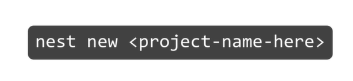
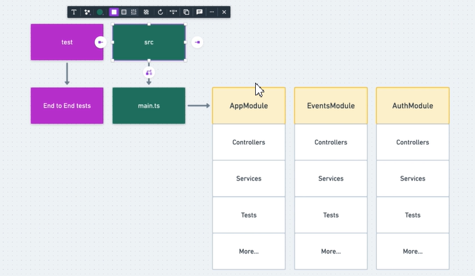
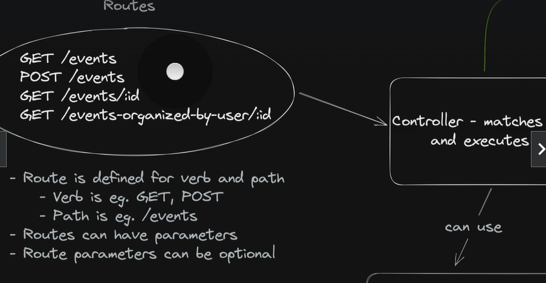
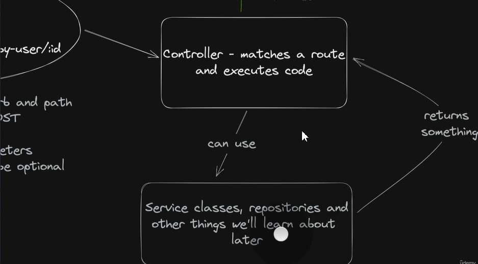

# Note
- Course: course/master-nestjs-the-javascript-nodejs-framework/learn/lecture/25602724

# Content
## Using CLI
- setting nest global: 
```bash
npm install -g @nestjs/cli
```
- create new prj: 
```
nest new <project-name>
```

- run prj: 
```
npm run start:dev
```

## Project structure
- run: 
```
npm run <command-name>
```


- Module is an abstract idea that groups certain functionality. (import Controller and Service)
- Controllers let you define your API endpoints.
- Service is a class where you'll put the business logic of the application

## Controllers, Routing, Requests
- Routing is basically defining for what paths, for what URLs and for what HTTP verbs



## Controllers
- The job of controllers is to create endpoints in your application using specific paths and Http verbs.

-> Then to accept requests, pass on the processing of that request to some other code in your project and then return back the response back to the client.
=> It controls the process of handling a request.

## Resource Controller