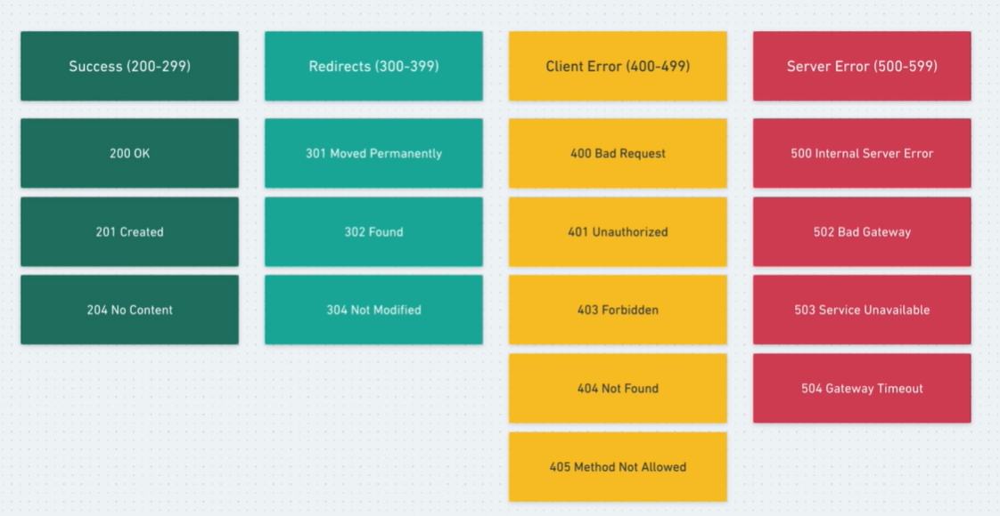

# Note
- Course: course/master-nestjs-the-javascript-nodejs-framework/learn/lecture/25602748#overview

# Content
## Resource Controller
- PATCH: wHeN want is to be able to update only specific properties of an object.
- PUT: it would require to send all resource properties every time

##  Route Parameters
- Using `@Param('sth')` decorator 
- How are dynamic parts in a route, like an ID, defined in NestJS?
-> By using a colon `:` followed by the parameter name in the route path
```
@Get(':id')
  findOne(@Param('id') id) {
    return id
  }
```
- Routes can have dynamic parts called route parameters.

- Route parameters are defined by colon followed by parameter name.

- Parameters are passed to actions using the param decorator.

## Request Body
- Using `@Body()` decorator 
```
  @Post()
  create(@Body() input) {
    return input
  }
```

## Responses and Status Codes
- Commonly Status Code 

- Using `@HttpCode(204)` to defind code, ex:204 is no content

## Request Payload - Data Transfer Objects
- DTO stands for Data Transfer Objects

## The Update Payload
- Using `PartialType` to extend (optional)
```
export class UpdateEventDto extends PartialType (CreateEventDto) {}
``` 
## Post: Create a new event
```
@Post()
  create(@Body() input: CreateEventDto) {
    const event = {
      ...input,
      when: new Date(input.when),
      id: this.events.length + 1
    }
    this.events.push(event)
    return this.events
  }
```

## PATCH: Update a event by id
```
@Patch(':id')
  update(@Param('id') id, @Body() input: UpdateEventDto) {
    const index = this.events.findIndex(event => event.id === parseInt(id))
    this.events[index] = {
      ...this.events[index],
      ...input,
      when: input.when ? new Date(input.when) : this.events[index].when
    }
    return this.events[index];
  }
```